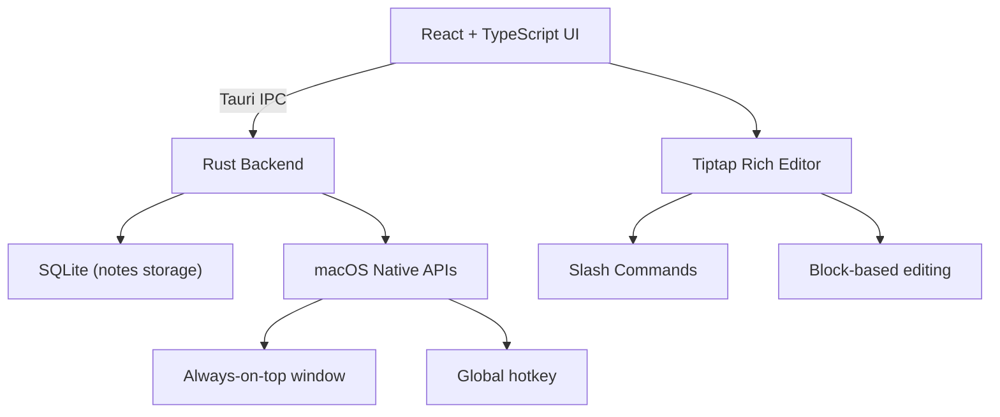

# 🗒️ NoteFast — Build Plan

> A minimal, always-on-top macOS note-taking app with a Notion-like rich editor

## Architecture



## Stack

| Layer | Technology | Purpose |
|-------|-----------|---------|
| Frontend | React + TypeScript | UI framework |
| Editor | Tiptap (ProseMirror) | Notion-like rich text editor |
| Styling | Tailwind CSS + shadcn/ui | Design system |
| Bridge | Tauri 2 | Native ↔ Web communication |
| Backend | Rust | Window management, persistence |
| Database | SQLite (via rusqlite) | Notes storage |
| Platform | macOS native APIs | Always-on-top, hotkeys |
| Distribution | DMG | macOS installer |

## Features (Phase 1)

### Core
- [x] Always-on-top sticky window (over all spaces including fullscreen)
- [x] Global keyboard shortcut to toggle (⌘+Shift+N)
- [x] Notion-like block editor with Tiptap
- [x] Slash command menu (`/` to trigger formatting)
- [x] SQLite persistence
- [x] Minimal, clean UI

### Slash Commands
- `/heading1`, `/heading2`, `/heading3` — Headings
- `/bulletlist` — Bullet list
- `/numberedlist` — Numbered list
- `/tasklist` — Todo/task list
- `/quote` — Blockquote
- `/code` — Code block
- `/divider` — Horizontal rule
- `/bold`, `/italic`, `/strikethrough` — Inline formatting

### Editor Features
- Rich text: bold, italic, strikethrough, code
- Block types: headings, lists, quotes, code blocks, dividers
- Task lists with checkboxes
- Keyboard shortcuts (⌘B, ⌘I, etc.)
- Placeholder text

## File Structure

```
NoteFast/
├── src/                        ← React + TypeScript
│   ├── components/
│   │   ├── ui/                 ← shadcn/ui components
│   │   ├── NoteList.tsx        ← Sidebar note list
│   │   ├── NoteEditor.tsx      ← Main editor wrapper
│   │   └── TitleBar.tsx        ← Custom title bar
│   ├── editor/
│   │   ├── Editor.tsx          ← Tiptap editor setup
│   │   ├── SlashCommand.tsx    ← Slash command menu
│   │   └── extensions.ts      ← Tiptap extensions config
│   ├── lib/
│   │   ├── db.ts               ← Tauri IPC for database
│   │   └── utils.ts            ← Utility functions
│   ├── App.tsx
│   ├── App.css
│   ├── main.tsx
│   └── index.css               ← Global styles + Tailwind
├── src-tauri/                  ← Rust + Tauri
│   ├── src/
│   │   ├── main.rs             ← Entry point
│   │   ├── lib.rs              ← Tauri setup
│   │   ├── database.rs         ← SQLite operations
│   │   └── commands.rs         ← Tauri commands
│   ├── Cargo.toml
│   └── tauri.conf.json
├── package.json
├── tsconfig.json
├── vite.config.ts
├── tailwind.config.js
└── pnpm-lock.yaml
```

## Build Steps

1. ✅ Install Rust
2. ⬜ Scaffold Tauri 2 + React + TypeScript project
3. ⬜ Add Tailwind CSS + shadcn/ui
4. ⬜ Build Rust backend (SQLite, window management)
5. ⬜ Build Tiptap editor with slash commands
6. ⬜ Build note list + UI components
7. ⬜ Wire up Tauri IPC
8. ⬜ Polish UI and test
9. ⬜ Build DMG
